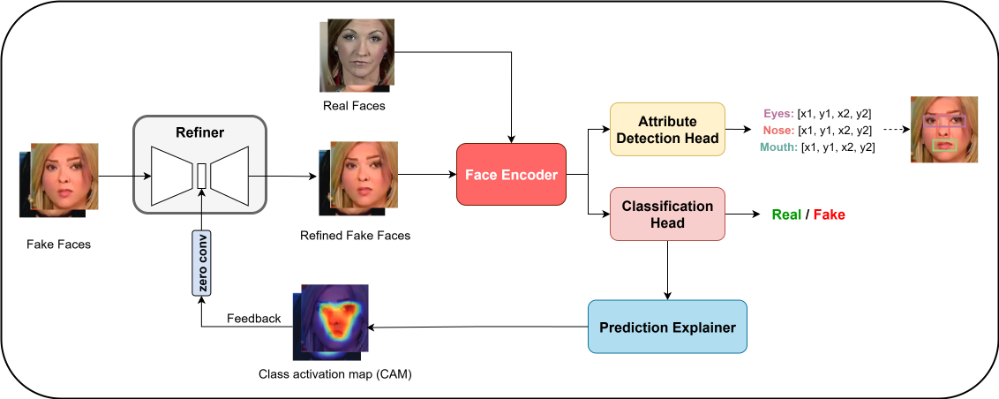

<p align="center">
  <a href="https://www.uit.edu.vn/"></a>
<h2 align="center">

---
# Enhancing Deepfake Image Reliability with Explainability-Guided Adversarial Game

[](https://opensource.org/licenses/MIT)
[](https://www.python.org/downloads/)
[](https://pytorch.org/)

This repository contains the implementation of our capstone project titled **"Enhancing the Reliability of Deepfake Image Detection Using Explainability-Guided Adversarial Game Approach"**. The project focuses on improving the robustness and generalization of deepfake detectors through an innovative adversarial training framework guided by explainability techniques.

Developed as part of our undergraduate thesis at the University of Information Technology - VNU-HCM, under the supervision of Dr. Phan The Duy and Dr. Pham Van Hau.

## Table of Contents
- [Introduction](#introduction)
- [Objectives](#objectives)
- [Methodology](#methodology)
- [Architecture](#architecture)
- [Dataset](#dataset)
- [Results](#results)
- [Installation](#installation)
- [Usage](#usage)
- [Contributing](#contributing)
- [References](#references)
- [Team](#team)
- [License](#license)

## Introduction

The rapid advancement of Generative AI technologies, such as GANs and Diffusion Models, has enabled the creation of highly realistic deepfake images and videos. While beneficial for applications like entertainment and data augmentation, deepfakes pose significant risks, including misinformation, political manipulation, and identity fraud. Traditional deepfake detectors, often based on CNNs, perform well on familiar datasets but struggle with generalization to unseen forgery techniques and are vulnerable to adversarial attacks.

This project proposes an **Explainability-Guided Adversarial Game (EAG)** framework to address these limitations. By integrating adversarial training with explainability (using Class Activation Maps - CAM), the detector learns robust, semantic features rather than superficial artifacts, enhancing reliability and interpretability.

## Objectives

### Main Objective
Develop a robust deepfake image detection system that improves reliability, generalization, and explainability.

### Specific Objectives
- Design an adversarial game between a Detector and a Refiner, guided by explainability signals.
- Incorporate multi-task learning to predict facial components (eyes, nose, mouth) alongside real/fake classification.
- Evaluate the framework on challenging datasets and compare with state-of-the-art methods.

### Scope
- Focuses on image-based detection (extracted from videos).
- Uses CAM for explainability; does not explore other XAI techniques like LIME or SHAP in depth.
- Limited to technical evaluation; ethical and deployment aspects are out of scope.

## Methodology

Our approach frames deepfake detection as a min-max game:
- **Detector (D)**: A multi-task CNN (ResNet-18 backbone) that classifies images as real/fake and predicts facial landmarks.
- **Refiner (R)**: An adversarial module that refines fake images to evade detection, guided by CAM heatmaps from the Detector.
- **Explainability Integration**: CAM heatmaps highlight detection-vulnerable regions, which the Refiner uses to mask and refine artifacts.
- **Training**: Alternating optimization where the Detector minimizes classification loss, and the Refiner maximizes evasion while preserving image structure.

Key losses:
- Detector: Binary Cross-Entropy (classification) + MSE (landmark prediction).
- Refiner: Adversarial loss + Reconstruction loss.

## Architecture

  

- **Face Encoder**: ResNet-18 for feature extraction.
- **Classification Branch**: Predicts real/fake.
- **Landmark Branch**: Predicts bounding boxes for eyes, nose, mouth.
- **Prediction Explainer**: Generates CAM heatmaps.
- **Refiner**: U-Net-like architecture with zero-conv layers for guided refinement.

## Dataset

We use **FakeAVCeleb**, a multimodal deepfake dataset with 500 real videos and ~19,500 fake videos across diverse demographics. Images are extracted as frames, preprocessed (face cropping, resizing to 224x224), and labeled with MTCNN for facial landmarks.

- Train/Val/Test split: Standard from the dataset.
- Focus: Visual modality only.

## Results

### Comparison with State-of-the-Art
On FakeAVCeleb (visual only):

| Method              | ACC (%) | AUC (%) | EER (%) |
|---------------------|---------|---------|---------|
| Xception       | 90.50   | 92.30   | 15.20   |
| MesoNet       | 88.70   | 90.10   | 18.40   |
| F3Net          | 92.10   | 93.80   | 12.50   |
| Ours         | **95.10** | **96.40** | **9.80**  |

Our method outperforms baselines, achieving state-of-the-art performance on visual deepfake detection.

### Ablation Study
Removing key components degrades performance:

| Variant                  | ACC (%) | AUC (%) |
|--------------------------|---------|---------|
| Baseline (No Adversarial)| 92.30   | 93.50   |
| No Multi-Task Learning   | 93.40   | 94.60   |
| Full Ours                | **95.10** | **96.40** |

For full results, see Chapter 4 in the report.

## Installation

1. Clone the repository:
   ```
   git clone https://github.com/fonzi22/fakeface_detection.git
   cd fakeface_detection
   ```

2. Create a virtual environment:
   ```
   python -m venv env
   source env/bin/activate  # On Windows: env\Scripts\activate
   ```

3. Install dependencies:
   ```
   pip install -r requirements.txt
   ```
   (Requires: PyTorch, torchvision, numpy, opencv-python, scikit-learn, etc.)

4. Download dataset: Follow instructions in `data/README.md` to prepare FakeAVCeleb.

## Usage

### Training
```
python train.py --dataset_path /path/to/fakeavceleb --epochs 50 --batch_size 16 --lr 0.001
```

### Evaluation
```
python evaluate.py --model_path checkpoints/best_model.pth --test_path /path/to/test_data
```

### Inference
```
python infer.py --image_path sample.jpg --model_path checkpoints/best_model.pth
```

For visualization (CAM heatmaps):
```
python visualize_cam.py --image_path sample.jpg
```

## Contributing

Contributions are welcome! Please open an issue or submit a pull request for bug fixes, improvements, or new features.

## References

Key references from the thesis:
- [1] Goodfellow et al., "Generative Adversarial Nets" (2014)
- [12] Zhou et al., "Learning Deep Features for Discriminative Localization" (CAM, 2016)
- Full list in Chapter 6 of the report.

## Team

| STT | Name               | MSSV     | Email                         |
| --- | ------------------ | -------- | ----------------------------- |
| 1   | Phan Nguyen Huu Phong | 22521090 | 22521090@gm.uit.edu.vn       |
| 2   | Chau The Vi        | 22521653 | 22521653@gm.uit.edu.vn       |


Supervisors: M.S. Phan The Duy & Ph.D. Pham Van Hau  

## License

This project is licensed under the MIT License - see the [LICENSE](LICENSE) file for details.
